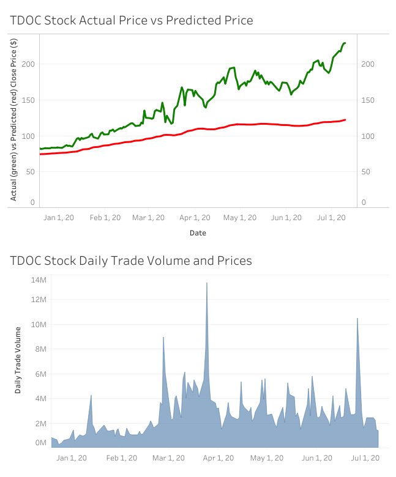

# Stock Price Prediction with LSTM

Train Long Short-Term Memory (LSTM) machine learning model using pre-COVID-19/historical data to see how well the model compares to what actually happened during COVID-19/current data for the following stocks:

* American Airlines - AAL (travel stock)
* Amazon - AMZN (online shopping - covid beneficiary)
* Bitcoin - BTC
* Chegg - CHGG (online education - covid beneficiary)
* Costco - COST (grocery - covid beneficiary)
* Gold - GOLD (“safe” investment)
* Halliburton - HAL (energy stock)
* Teledoc - TDOC (online doctors visits - covid beneficiary)
* Tesla - TSLA (car/EV/FOMO stock)

### Github Pages Site

https://ivytiongco.github.io/machine-learning-stock-analysis/

### Presentation Slides

Included in this repo

### Datasets

Downloaded from Yahoo Finance for July 2018 - July 2020

### Tools/Packages Used
* Scikit-Learn
* Keras
* Pandas
* Numpy
* Matplotlib
* Tableau
* HTML/CSS/Bootstrap

### Visualizations 
* Blue and orange lines are actual closing prices
* Green lines are predicted values

Additional graphs for AAL, AMZN, TDOC, TSLA:
* Link to Tableau to interact with the visualizations
* Actual vs. predicted closing prices
* Daily trade volumes and prices

https://public.tableau.com/profile/nicholas.theriot#!/vizhome/AAL_dashbaord2/Dashboard1

https://public.tableau.com/profile/ivy.tiongco#!/vizhome/TDOC_dashboard/Dashboard1

#### Authors
* Emily Akemann
* Alex Burch
* Jessica Nugent
* Nick Theriot
* Ivy Tiongco
