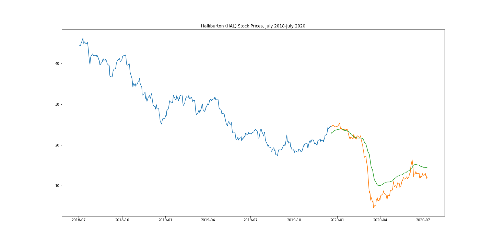

# Stocks and Machine Learning in a Time of Covid

Purpose: 

To use machine learning to predict stock behavior had the March 2020 stock market crash due to the global pandemic not happened

Background: 

There was a large market crash in March 2020 due to fears surrounding the spread of Covid-19 and many countries around the world issuing stay at home orders. Due to wild speculation about the market’s recovery and low rates of return in typically “safe” investments like bonds, there has been an unprecedented rush of money into the market. Tech, online education, e-commerce, and grocery stocks have benefitted the most being for the most part unaffected by stay at home orders, however EV (electric vehicle) stocks like Tesla have also had an army of new investors rush in. Stocks that have also seen a lot of volatility and have yet to recover since the crash include travel-related stocks like airlines and cruises, as well as oil which at the same time had a price war between Russia and Saudi Arabia.

Using Machine Learning to Answer “What If”:
* We chose the LSTM Long-Short-Term Memory Recurrent Neural Network as our machine learning model.
  * Popular for time-series forecasting for classification, processing, and making predictions.
* We used two years of individual stock closing price data from July 2, 2018 – July 9, 2020.
* We trained and tested the LSTM model on data up to December 19, 2019.
* We predicted the stock prices after December 19, 2019 with the already-trained LSTM model.
* We plotted the predicted stock prices against the actual prices for that time period to visualize the model’s accuracy.

Stocks Analyzed:
* American Airlines - AAL (travel stock)
* Amazon - AMZN (online shopping - covid beneficiary)
* Bitcoin - BTC
* Chegg - CHGG (online education - covid beneficiary)
* Costco - COST (grocery - covid beneficiary)
* Gold - GOLD (“safe” investment)
* Halliburton - HAL (energy stock)
* Teledoc - TDOC (online doctors visits - covid beneficiary)
* Tesla - TSLA (car/EV/FOMO stock)

### Github Pages Site

https://ivytiongco.github.io/machine-learning-stock-analysis/

### Presentation Slides

Included in this repo

### Datasets

Downloaded from Yahoo Finance for July 2018 - July 2020

### Tools/Packages Used
* Scikit-Learn
* Keras
* Pandas
* Numpy
* Matplotlib
* Tableau
* HTML/CSS/Bootstrap

### Visualizations 
Graphs for AAL, AMZN, TDOC, TSLA:
* Actual vs. predicted closing prices
* Daily trade volumes and prices
* Link to Tableau to interact with the visualizations

https://public.tableau.com/profile/nicholas.theriot#!/vizhome/AAL_dashboard_final/Dashboard1?publish=yes

https://public.tableau.com/profile/nicholas.theriot#!/vizhome/AMZN_Dashboard/Dashboard1?publish=yes

https://public.tableau.com/profile/ivy.tiongco#!/vizhome/TDOC_dashboard/Dashboard1

https://public.tableau.com/profile/alexander7777#!/vizhome/TSLA_dashboard/Dashboard1?publish=yes

Graphs of all stocks:
* Blue and orange lines are actual closing prices
* Green lines are predicted values

#### Authors
* Emily Akemann
* Alex Burch
* Jessica Nugent
* Nick Theriot
* Ivy Tiongco
